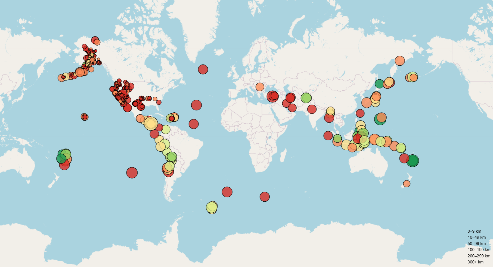
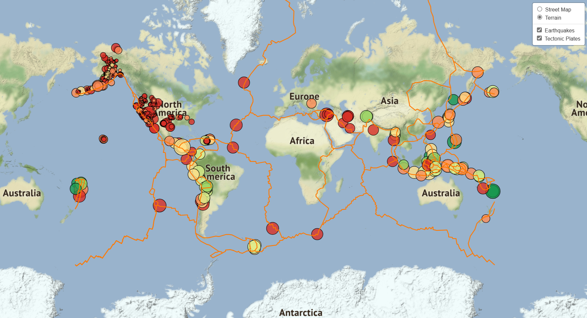

# Leaflet-Challenge

## Background

The United States Geological Survey, or USGS for short, is responsible for providing scientific data about natural hazards, the health of our ecosystems and environment, and the impacts of climate and land-use change. Their scientists develop new methods and tools to supply timely, relevant, and useful information about the Earth and its processes.

The USGS is interested in building a new set of tools that will allow them to visualize their earthquake data. They collect a massive amount of data from all over the world each day, but they lack a meaningful way of displaying it. In this challenge, you have been tasked with developing a way to visualize USGS data that will allow them to better educate the public and other government organizations (and hopefully secure more funding) on issues facing our planet.

### Part 1: Create the Earthquake Visualization

The USGS provides earthquake data in a number of different formats, updated every 5 minutes. Visit the USGS GeoJSON https://earthquake.usgs.gov/earthquakes/feed/v1.0/geojson.php Link page and choose a dataset to visualize. 

### Part 2: Gather and Plot More Data 

Plot a second dataset on your map to illustrate the relationship between tectonic plates and seismic activity. You will need to pull in this dataset and visualize it alongside your original data. Data on tectonic plates can be found at https://github.com/fraxen/tectonicplatesLinks to an external site..

## References

(Vandrea Foronda. July 24, 2023) 'https://github.com/themacdrea/leaflet-challenge'